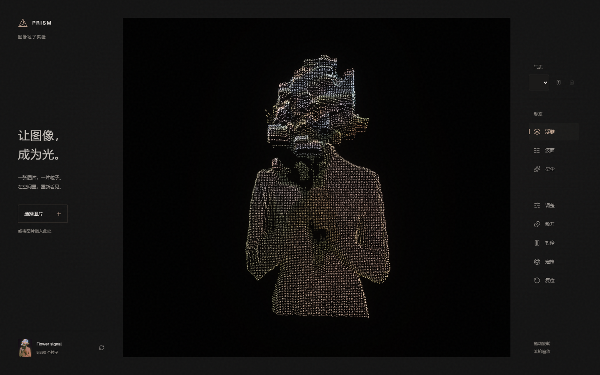

# PRISM

把一张图像重构为可旋转、可呼吸、可定格的三维粒子作品。



PRISM 是一个作品优先的浏览器粒子实验室。图片直接在浏览器内解码与采样，数万个颜色粒子由自定义 shader 实时渲染。界面退到两侧，中央完整留给作品。

## 为什么做它

多数图像粒子工具要么只是一次性的特效演示，要么把二十多个参数同时摆在用户面前。PRISM 选择一条更克制的路径：先自动得到清晰作品，再用“气质”预设决定感觉，只在需要时打开微调，最后进入定格模式导出。

## 已实现

- 图片选择、全窗口拖放、剪贴板粘贴；支持 PNG、JPEG、WebP、AVIF，最大 30 MB
- 基于透明度、边缘背景与亮度的自适应采样，透明边距不影响构图
- 浮雕、波面、星尘三种连续形态，以及显影、潮汐、游离、余烬四种气质
- 景深、流动、粒径微调；自定义气质保存在浏览器
- 鼠标/触控旋转、滚轮/双指缩放、光标粒子场、散开/聚合与暂停
- 自动、轻盈、均衡、精致四档质量；自动模式根据持续帧率调整粒子预算、DPR 与辉光
- 无干扰定格模式和 2× PNG 导出
- 键盘路径、减少动效、错误反馈和 320px/矮横屏响应式支持

## 开始使用

需要 Node.js 20 或更高版本。

```bash
npm install
npm run dev
```

打开终端显示的本地地址。生产构建：

```bash
npm run build
npm run preview
```

运行浏览器验收前先启动开发服务器：

```bash
npm run test:ui
```

Windows 默认查找 Chrome；其他系统可通过 `CHROME_PATH` 指定 Chromium/Chrome 可执行文件。

## 操作

| 操作 | 结果 |
| --- | --- |
| 拖动 / 单指移动 | 旋转作品 |
| 滚轮 / 双指捏合 | 缩放作品 |
| `Ctrl/Cmd + O` | 选择图片 |
| 粘贴图片 | 直接导入 |
| `Space` | 画布聚焦时暂停/继续 |
| 方向键 | 画布聚焦时旋转 |
| `Escape` | 关闭当前层级或复位视角 |

## 技术结构

- Vite + 原生 HTML/CSS/JavaScript
- Three.js `Points` + `ShaderMaterial`
- EffectComposer + UnrealBloomPass
- GSAP 驱动 uniform 与界面过渡
- Playwright Core 做多视口与交互回归

所有粒子在一个 draw call 中绘制；设备质量档限制采样数、DPR 与后处理成本。详细管线见 [架构说明](docs/ARCHITECTURE.md)。

## 文档

- [产品需求与路线](docs/PRD.md)
- [竞品与技术调研](docs/MARKET_RESEARCH.md)
- [逐步优化记录](docs/OPTIMIZATION_LOG.md)
- [架构说明](docs/ARCHITECTURE.md)
- [参与开发](CONTRIBUTING.md)

## 隐私

导入的图片只在当前浏览器中解码、采样和渲染，不上传到服务器。自定义气质只写入 localStorage；导出的配方规划也不会包含原图数据。

## 项目状态

V1.1 正在开发。当前重点是补齐 WebP/配方导出、自定义气质管理、画面参数与模块化；后续再推进连续重组、流场形态和视频导出。状态以 [PRD](docs/PRD.md) 中的 ✅ / 🚧 / 🔜 / ⏸ 为准。

