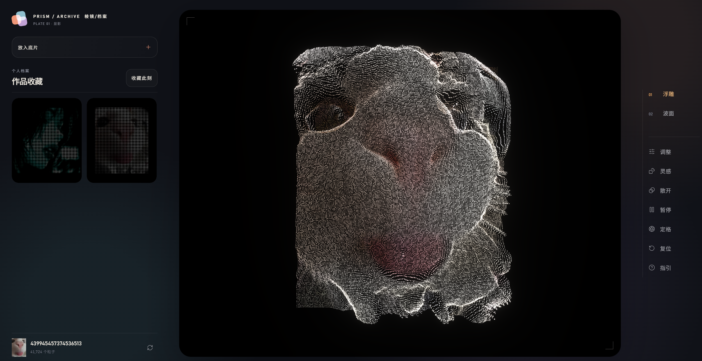

# PRISM

**将一张图像转化为可旋转、可保存、可重开的粒子作品。**




PRISM 是一个浏览器内的图像粒子实验项目。导入图片后，它会将图像采样成可互动的三维粒子场；画面、参数和视角可以收进作品档案，之后在主编辑器中完整恢复。

这是一个仓库项目展示，不部署到个人网站或 GitHub Pages。

## 核心体验

- 导入 PNG、JPEG、WebP、AVIF 图片，支持拖放与粘贴
- 两种精炼的空间形态：浮雕与波面
- 拖动旋转、滚轮或双指缩放、散开、暂停与定格
- 可调景深、流动、粒径、辉光、色温、饱和度和质量档
- 「收藏此刻」保存源图快照、全部参数、旋转与缩放视角
- 点击作品缩略图，直接在中央编辑器重建保存时的原图和创作状态
- WebGL 不可用时自动切换到 2D 点阵兼容显示，避免空白画布

## 作品收藏

作品不是参数预设。每次收藏会记录：

- 源图快照（最大边 1600px 的 WebP）
- 当前粒子参数和形态
- 画布旋转与镜头缩放
- 成品缩略图和预览图

新收藏的作品可在左侧「作品收藏」中点击恢复。历史版本中没有源图快照的作品仍可预览或删除，但不能精确重建。

## 本地运行

需要 Node.js 20 或更高版本。

```bash
npm install
npm run dev
```

打开终端输出的本地地址。生产构建：

```bash
npm run build
npm run preview
```

浏览器交互检查（先启动开发服务）：

```bash
npm run test:ui
```

## 操作


| 操作           | 结果               |
| -------------- | ------------------ |
| 拖动 / 单指    | 旋转粒子作品       |
| 滚轮 / 双指    | 缩放               |
| `Ctrl/Cmd + O` | 选择图片           |
| 粘贴           | 导入剪贴板图片     |
| `Space`        | 暂停画面           |
| `B`            | 收藏当前作品       |
| `?`            | 打开快捷键图例     |
| `S`            | 定格模式下导出 PNG |
| `Escape`       | 关闭当前层或复位   |

## 技术

- Vite + 原生 HTML、CSS、JavaScript
- Three.js Points 与 ShaderMaterial
- EffectComposer / UnrealBloomPass
- GSAP 处理参数过渡
- IndexedDB 保存作品档案
- Canvas 2D 作为 WebGL 后备渲染
- Playwright Core 做多视口交互检查

## 项目文档

- [产品需求](docs/PRD.md)
- [竞品与技术调研](docs/MARKET_RESEARCH.md)
- [逐步优化记录](docs/OPTIMIZATION_LOG.md)
- [架构说明](docs/ARCHITECTURE.md)
- [参与开发](CONTRIBUTING.md)

## 隐私

图片只在当前浏览器内解码、采样和渲染，不上传到服务端。作品档案存储在浏览器 IndexedDB 内。

## 许可

[MIT](LICENSE)
